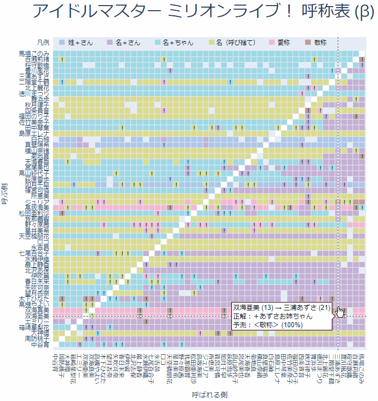

アイドルマスター ミリオンライブ！(Million Live) x 機械学習 (Machine Learning) = ML^2

# Products

* [アイドルマスター ミリオンライブ！ 呼称表（β）](https://submeganep.github.io/koshou.html

    * マウスホバー（またはタップ）で呼称をインタラクティブ表示
    * AI（機械学習）の予測と異なる呼称に「！」マーク（キテる！）
    * ミリシタのオファーと異なる呼称に「＋」マーク（未実装）
    * 以下の情報を参考にさせていただいております（感謝）
        * [グリマス日和 呼称まとめ](http://greemas.doorblog.jp/tag/%E5%91%BC%E7%A7%B0%E3%81%BE%E3%81%A8%E3%82%81)
        * [ニコニコ大百科 アイドルマスター ミリオンライブ！:呼称表](https://dic.nicovideo.jp/a/%E3%82%A2%E3%82%A4%E3%83%89%E3%83%AB%E3%83%9E%E3%82%B9%E3%82%BF%E3%83%BC%20%E3%83%9F%E3%83%AA%E3%82%AA%E3%83%B3%E3%83%A9%E3%82%A4%E3%83%96%21%3A%E5%91%BC%E7%A7%B0%E8%A1%A8)

* アイドルマスター ミリオンライブ！ シアターデイズ 類似衣装検索
    * 作成中

# Link

* Blog: [ML^2](https://submeganep.hatenablog.com/)
* Twitter: [submeganep](https://twitter.com/submeganep)
* GitHub: [submeganep](https://github.com/submeganep)
